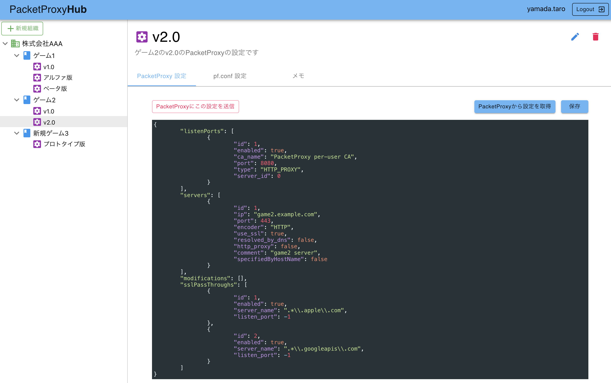

# PacketProxyHub

PacketProxyHubはPacketProxyの設定をチーム間で共有するためのWebサービスです。
 
 

## ライセンス

Apache License 2.0

## セットアップ方法

セットアップ方法は[こちら](https://github.com/DeNA/PacketProxyHub/wiki/%E3%82%BB%E3%83%83%E3%83%88%E3%82%A2%E3%83%83%E3%83%97%E6%96%B9%E6%B3%95)

## 利用方法

利用方法は[こちら](https://github.com/DeNA/PacketProxyHub/wiki/%E5%88%A9%E7%94%A8%E6%96%B9%E6%B3%95)

## セキュリティについて

PacketProxyHubには脆弱性診断の設定情報が保存されるという性質上、外部公開せず、チームメンバーのみがアクセスできるようにセキュリティ設定してください。

